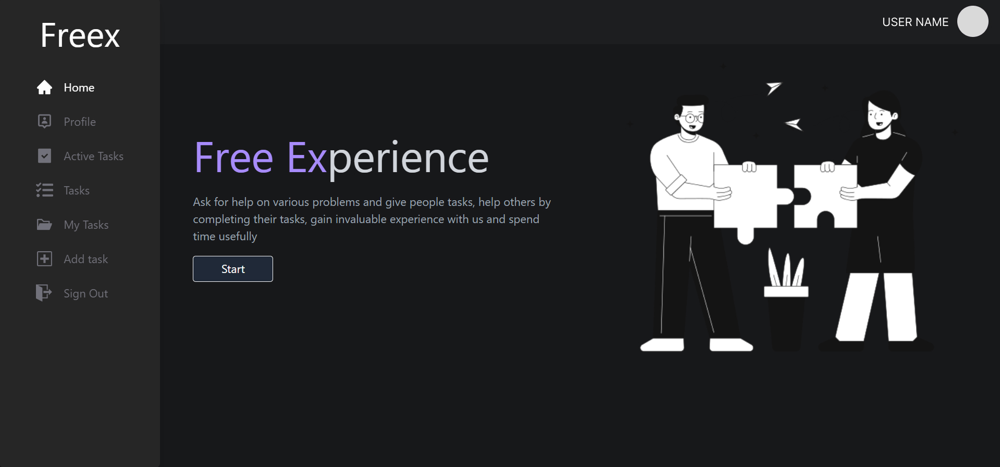
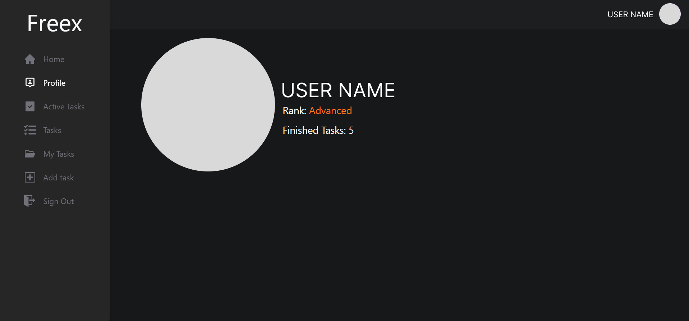
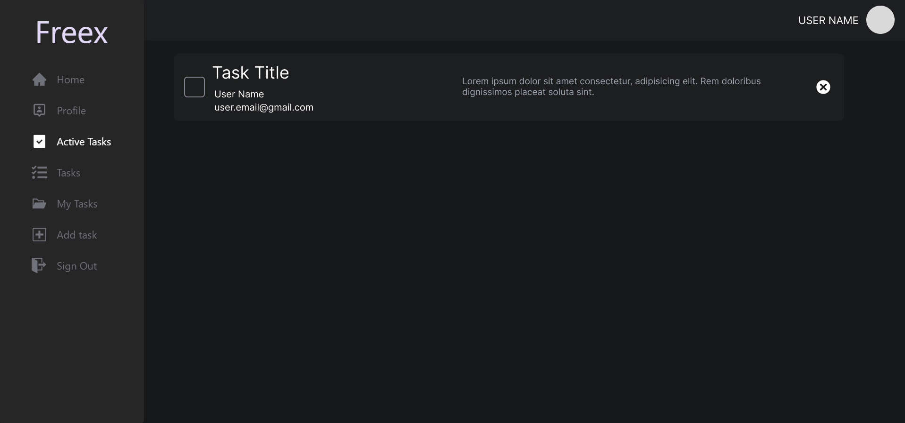
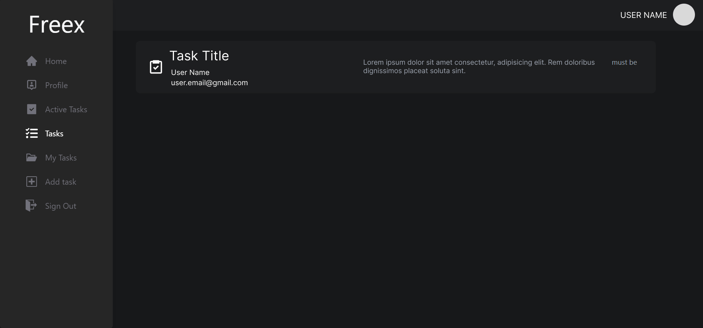
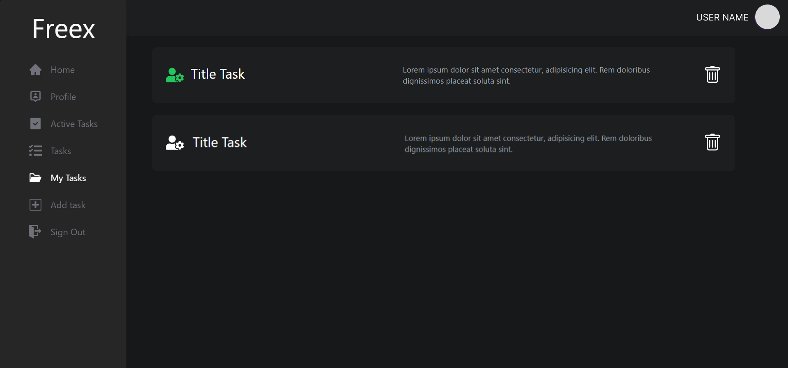
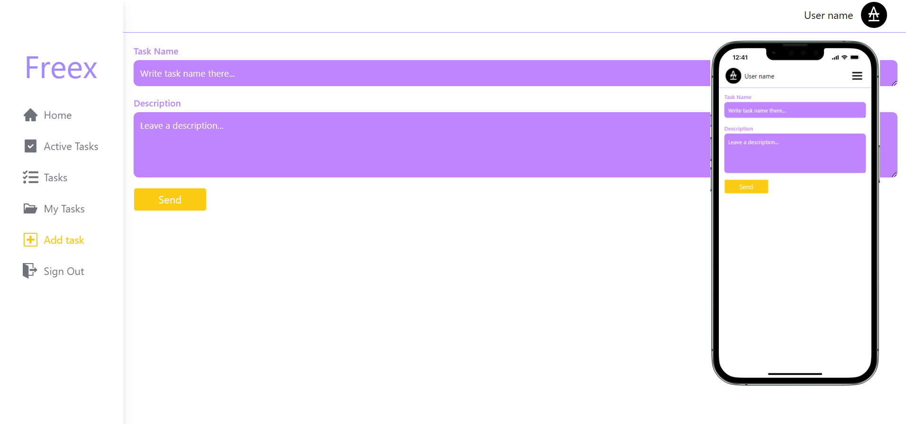

# Freex
**"Free Experience"** is the full name of this application. The objective of this app is to empower people to help each other and gain experience. This means that if a person needs some kind of help in any matter, he can write it in the task. Other participants will be able to solve this activity and contact them e-mail. When the person completes his task, he selects it in his "Active Tasks" tab and can send him the project by e-mail. And the client will have a green icon next to his task in the "My Tasks" tab, and when clicked, the person who completed his task will get 1 point. And the job itself is removed from the database. By receiving points, participants increase their rank (from 0 to 5 "Beginning", from 5 to 10 "Advanced", from 10 and then "Master")

# Available Scripts

### `npm i`
To download libraries

### `npm run start`
To start app

### `npm run build`
To build app

 
 

# Technology
- React
- Tailwind
- Firebase
- HTML
- CSS
- JS
