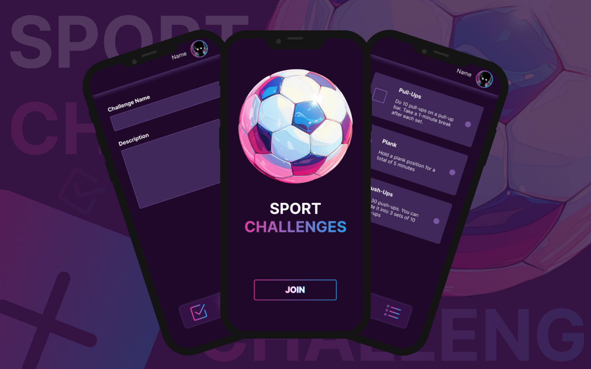

# Sport Challenges
**Sport Challenges** is an application designed for individuals to create and engage in athletic challenges and tasks, fostering a community-driven approach to fitness. Users can set their own sport-related challenges for others to undertake. Likewise, they can participate in challenges created by fellow users. As challenges are completed, users earn points, contributing to their overall level within the application. This gamified system provides motivation and encourages active participation in various sports and fitness activities

# Technology
- React
- Tailwind
- Firebase
- HTML
- CSS
- JS
